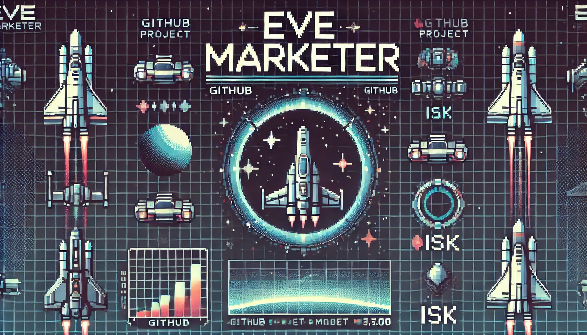

# 🚀 EVE Marketer (En Desarrollo)



**Herramienta de análisis de mercado para EVE Online**  
*"Calculando la rentabilidad entre precios de mercado y costes de fabricación"*

⚠️ **Estado actual**: Proyecto en aprendizaje activo sobre la API ESI de EVE Online  
🔗 **Repositorio**: [github.com/kzon94/eve-marketer](https://github.com/kzon94/eve-marketer)

## 📊 Objetivo Final

Desarrollar un programa completo que compare:
- 💰 Precios actuales de mercado (Jita 4-4)
- 🏭 Costes de fabricación (incluyendo PI)
- 📈 Históricos de precios
- 📉 Cálculo automático de rentabilidad

## 🔍 Origen de los Datos

El archivo `tier_name_typeid.csv` se genera a partir del:  
[TypeID List de chribba (eve-files.com)](https://eve-files.com/chribba/typeid.txt)  
*(Filtrado para mostrar solo materiales de Industria Planetaria - PI)*

## 🛠️ Configuración Actual

1. **Prepara tu CSV** con columnas esenciales:
   ```csv
   tier,name,type_id
   1,Enriched Uranium,2267
   2,Oxygen,2841
   ```

2. **Obtén el reporte** (`tier_name_price_jita.csv`):
   ```
   tier, name, type_id, current_buy_price, avg_buy_price_1d, ...
   ```

## 🌟 Características Implementadas

- ✅ Extracción de precios actuales en Jita 4-4
- ✅ Históricos de 1/7/31 días
- ✅ Procesamiento por lotes (20 items/request)
- ✅ Filtrado especializado para materiales PI

## 📚 Lo Que Estoy Aprendiendo

- 📡 Uso avanzado de la API ESI de EVE
- ⏱ Manejo de rate limiting
- 🧮 Cálculo de márgenes de rentabilidad
- 📊 Visualización de datos de mercado

## 🚧 Próximos Pasos

1. Integrar cálculo de costes de fabricación
2. Añadir módulo de visualización gráfica
3. Implementar sistema de alertas de rentabilidad
4. Crear interfaz de usuario intuitiva

## 🤝 Cómo Contribuir

```bash
# Clona el repositorio
git clone https://github.com/kzon94/eve-marketer.git
cd eve-marketer

# Instala dependencias
pip install -r requirements.txt
```

**Roadmap completo**: [Issues del proyecto](https://github.com/kzon94/eve-marketer/issues)

## 📄 Licencia

MIT License © 2023 [kzon94](https://github.com/kzon94)  
*Proyecto no afiliado a CCP Games*

---

🛡 **Aviso para Capsulistas**:  
*"Este proyecto es un work in progress - Fly safe and watch your wallet!"*  
🔗 *Documentación API ESI: [esi.evetech.net](https://esi.evetech.net)*
```
